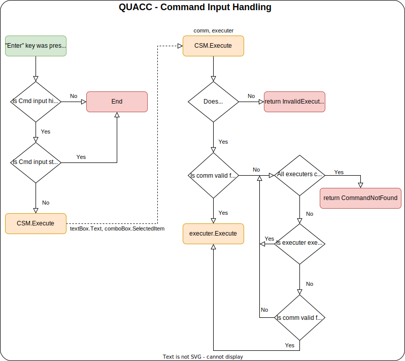

First, let's learn how to even control QUACC. Currently there is not much functions that would correspond to some hotkeys. The only one in fact is hiding and showing the command window. When the window is shown, use *ESC* to hide it and then *Shift+Ctrl+P* to show it again.

QUACC is command executing tool that can really help you focus on those really productive things. But to learn how to use it, you should know how QUACC works first. Below you can see a simple diagram of command input handling.

# Executers

Executers are classes that hold specific commands and corresponding execution functions. Currently, the only functional executer is the main `QUACCCommandsExecuter`.

## QUACCCommandsExecuter

This executer is responsible for basic sources navigation and resource management. It allows you to directly navigate to any *source* (directory, file, browser accessible URL) and to create shortcuts to those sources. Also it ~~can~~ will manage basic features like notes and stuff... Didn't really decided to what all I want to add. Below is list of all commands provided by the main `QUACCCommandExecuter` and their description.

### Hello World!

> hw **#args**

This command pops up a message box with a "Hello World" message. The `#args` input is also displayed.

### Open

> op **#arg**

This command checks whether you have registered a shortcut to a *source* with the name `#arg`.

### Add Shortcut

> adds **#name** **#path**

This command creates a new shortcut under the name `#name` pointing to a *source* defined by `#path`.

### Exit

> exit

This command saves your shortcuts and exits the application.