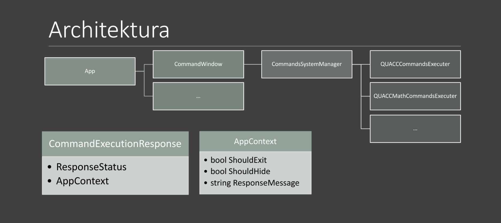
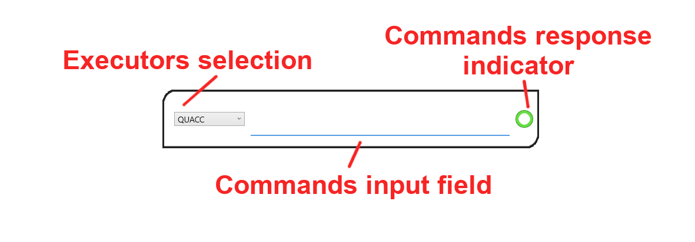

QUACC is command executing tool that can really help you focus just on those important things. It provides you with many features that can help you save some time that would be otherwise completely wasted.

# Architecture overview

# Visuals

Currently there is only one window - Command Window. Overview of it's important parts is below.

## Commands Input Field

Here you can write your commands. After pressing *Enter*, QUACC will try to execute it.

## Commands Response Indicator

This indicator has two variants: green and red. Green indicates successful command execution and red means there has been some sort of error. This indicator's tooltip provides further information about the response.

## Executors Selection

This is where you can change current Commands Executer.

# Controls

Now, let's learn how to control QUACC. Currently there is not much hotkey funtions. The only one in fact is hiding and showing the command window. When the window is shown, use *ESC* to hide it and then *Shift+Ctrl+P* to show it again.

# Executers

Executers are classes that hold specific commands and corresponding execution functions. Currently, the only functional executer is the main `QUACCCommandsExecuter`.

## QUACCCommandsExecuter

This executer is responsible for basic sources navigation and resource management. It allows you to directly navigate to any *source* (directory, file, browser accessible URL) and to create shortcuts to those sources. Also it ~~can~~ will manage basic features like notes and stuff... Didn't really decided to what all I want to add. Below is list of all commands provided by the main `QUACCCommandExecuter` and their description.

### Hello World!

> hw **#args**

This command pops up a message box with a "Hello World" message. The `#args` input is also displayed.

### Add Shortcut

> as **#name** **#path**

This command creates a new shortcut under the name `#name` pointing to a *source* defined by `#path`.

### Remove Shortcut

> rs **#name**

This command removes shortcut under the name `#name`.

### Open Shortcut

> os **#name**

This command checks whether you have registered a shortcut to a *source* with the name `#name`. If it is not recognised as a shortcut, QUACC tries to navigate to and open the *source* directly.

### Search

> s **#args**

Initiaties a Google search of given `#args`. In the future the search engine will be changeable.

### Hide

> h

This command hides the application - same as pressing *ESC*.

### Exit

> x

This command saves your shortcuts and exits the application.